<div align="center">

# Môme DM

**A parental-control app for families that runs entirely between two phones.**

No cloud. No account. No subscription. A parent's phone talks to a child's phone
over Bluetooth Low Energy, and nothing else is involved.

[](https://github.com/nosari20/momedm/actions/workflows/ci.yml)
[](LICENSE)
[-3ddc84.svg)](https://developer.android.com)
[](app/src/main/res)

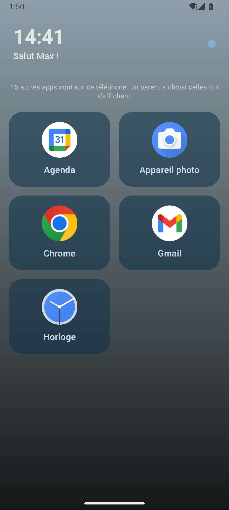
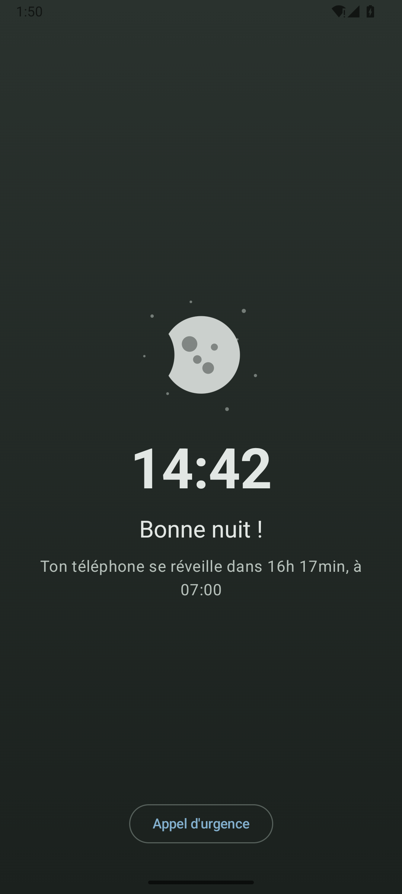
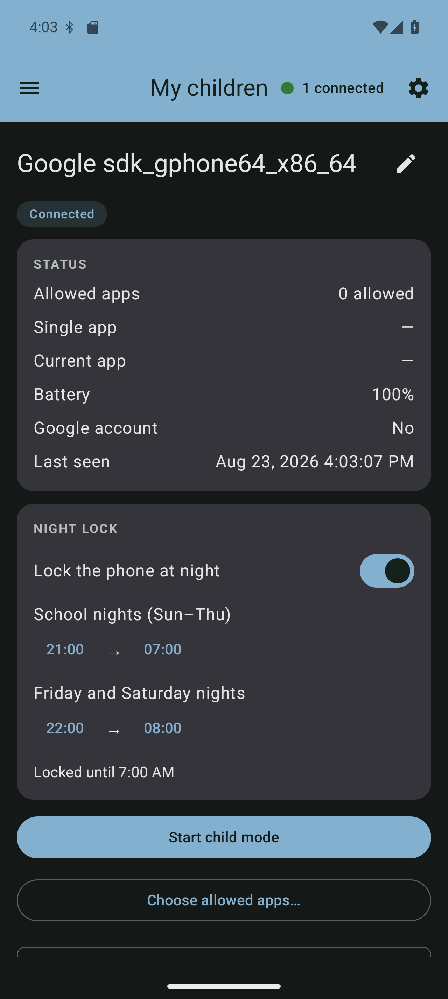

</div>

---

## What it is

Most parental-control tools route a child's activity through someone else's
servers. Môme DM doesn't. It is one Android app installed on two phones:

- On the **child's phone** it is the device owner — it becomes the home screen,
  decides which apps exist, and can lock the device completely.
- On the **parent's phone** it is a small control panel that talks to the child's
  phone directly over BLE when they are near each other.

Everything the child's phone enforces keeps working when the parent is out of
range, asleep, or has a flat battery. The parent's phone is a remote control, not
a dependency.

> **What this is not.** A parenting aid, not a security product. A factory reset
> removes it, and a determined teenager will eventually find the edges. It is
> built for the ordinary case: agreeing on rules and letting the phone hold them.

### How the two phones talk

Wi-Fi appears exactly once, to get the app onto the child's phone — after that the
two phones only ever speak over Bluetooth, and the child's phone enforces the rules
whether or not yours is anywhere near.

<div align="center">
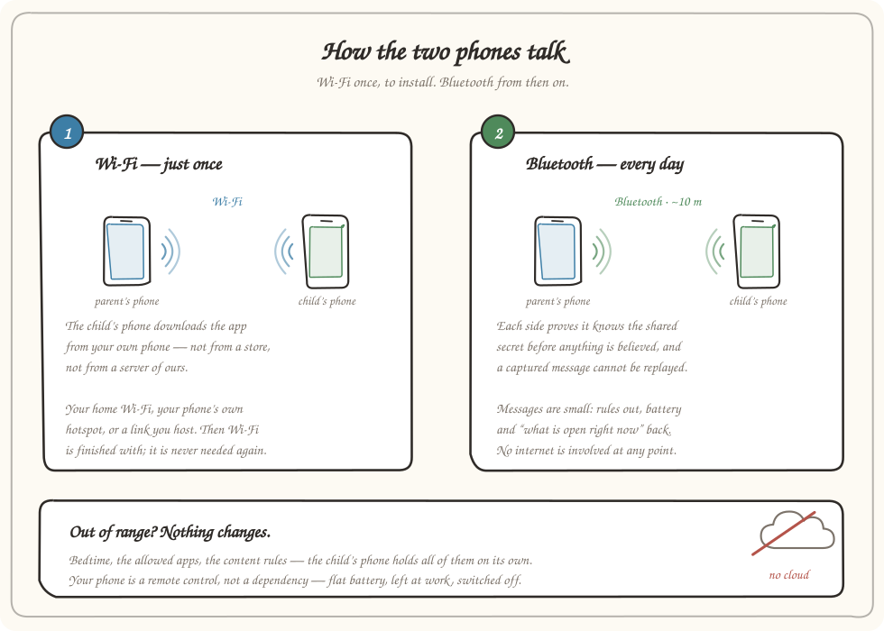
</div>

## Features

### Choose which apps exist

The parent picks the apps their child may use. Everything else is not on the home
screen and cannot be launched — this is Android's lock task mode. Home and recents
still work, so the phone feels ordinary, but they only ever lead back to the
allowed apps: the allowlist, not the navigation bar, is what decides what can
start. Optionally pin the child to **one single app**, useful when handing a
phone over for a specific purpose.

<div align="center">
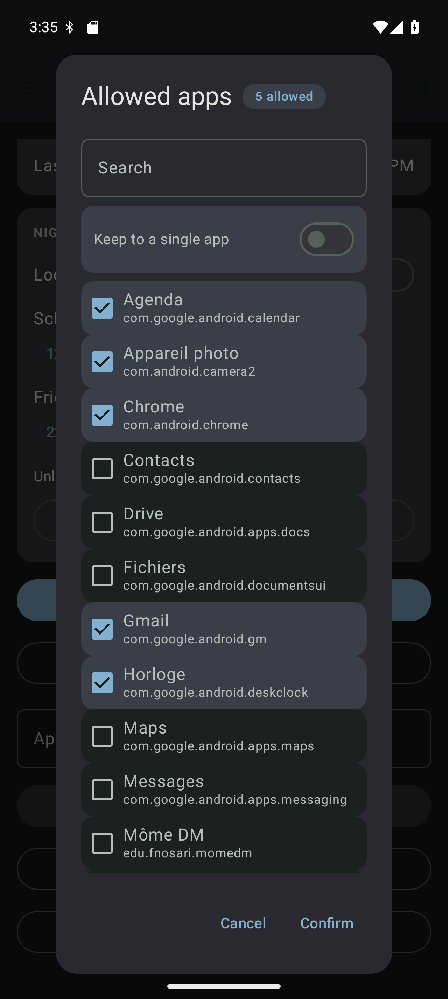
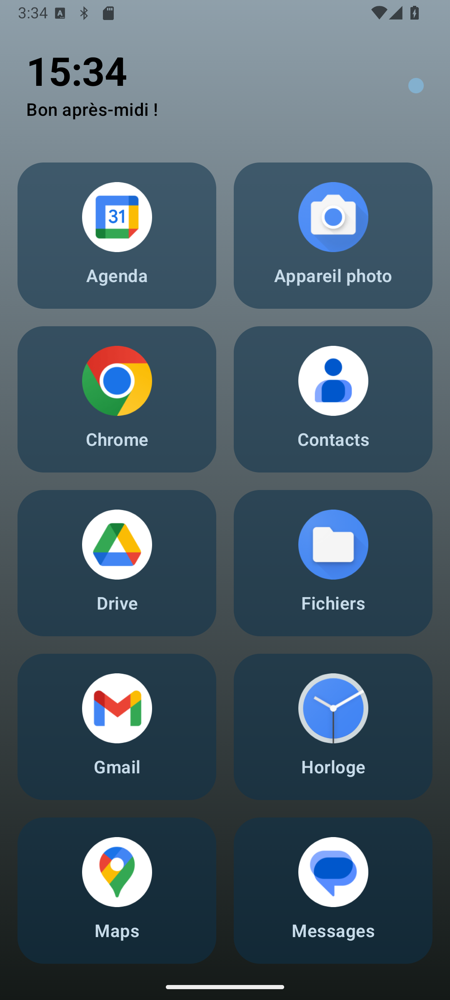
</div>

### Content restrictions, and per-app settings

Three levels — off, moderate, strict — that turn on SafeSearch, Chrome's Safe
Browsing, and YouTube's Restricted Mode, plus an optional family DNS resolver
applied to the whole phone rather than to one browser. The dialog says plainly
what each covers and what it does not: browser settings only reach Chrome, and the
YouTube app ignores them, so without the phone-wide resolver YouTube is
unfiltered. Restricted Mode hides most mature content, not all of it.

<div align="center">
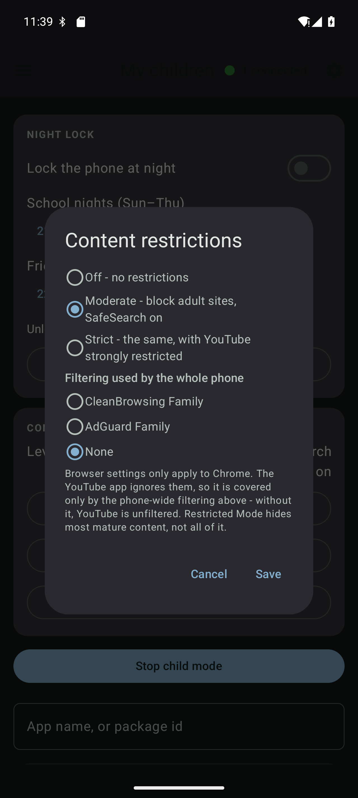
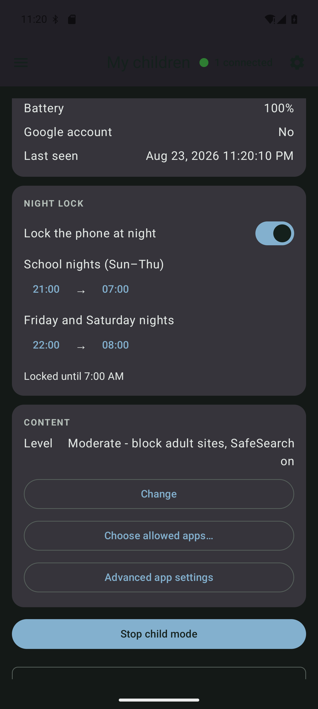
</div>

Underneath that sits a general escape hatch. Many apps declare their own
**managed configuration** — Chrome declares hundreds of settings — and the app
reads whatever an app declares on the child's phone and builds a form from it.
Nothing about those settings is hardcoded here: switches, choices, numbers, text,
groups of fields and repeatable lists of groups are all rendered from the app's
own schema, so an app this project has never heard of can still be configured.
Anything a form cannot represent is listed as not editable rather than hidden.

<div align="center">
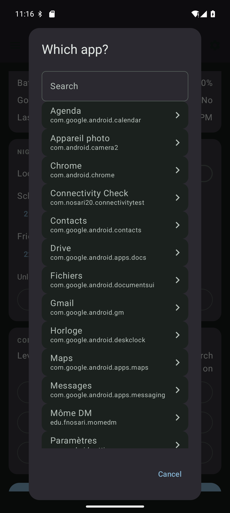
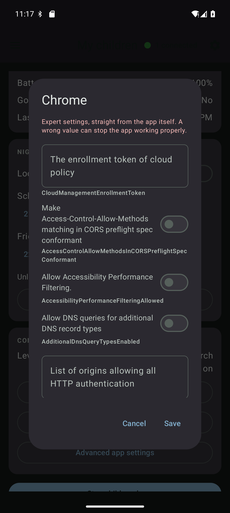
</div>

### A home screen built for a child

Not a cut-down admin console: a big clock, a greeting that follows the time of
day, large rounded app tiles that arrive one after another, and a small dot
showing whether the parent's phone is nearby. The background carries a faint
warmth in the morning and cools off in the evening — tied to the clock and
nothing else, so it can never read as a reward or a telling-off. Meant to feel
normal for a child up to about 14: friendly without being babyish.

**A little of it belongs to the child.** Tapping the greeting lets them say what
the phone should call them, and pick the moon that shows on the bedtime screen.
Both are stored on their own phone and are never sent to the parent — there is
nothing there to approve, and nothing to take away as a consequence. The parent
owns the rules; this is the part the child owns.

If some apps are hidden, the grid says so and says a parent chose — so a short
list of apps never looks like a broken phone.

There is no visible lock button, deliberately. A parent unlocks by
**long-pressing the header**, which opens the PIN pad. A child looking at the
screen finds nothing to poke at.

### Night lock — a bedtime the phone keeps on its own

Set a bedtime window and the phone locks itself: no apps, just a quiet screen
with the time, a moon, and how long is left. Separate windows for school nights
and for Friday and Saturday, because those differ in most houses. The parent can
also lock the phone **right now** from their own device.

The moon is the real one for tonight — the actual phase, which a child can check
against their window — and in the last three quarters of an hour the sky warms up
and the stars fade, so morning arrives on its own rather than as a number counting
down. The screen says "your phone wakes up in 7h 20min" before it says 07:00,
because *how long* is the question a child actually has. Nothing on it moves or
can be tapped: it is a screen for ending the evening, not another thing to play
with.

<div align="center">
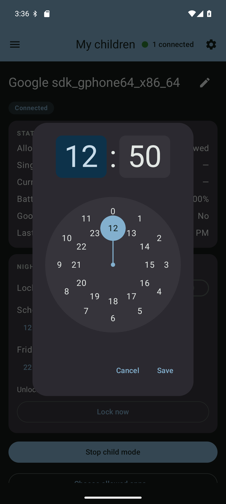
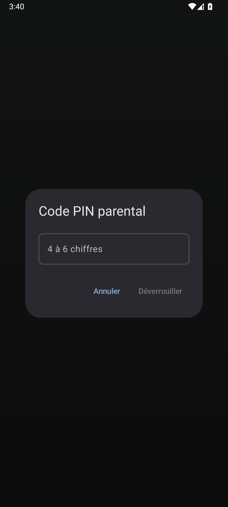
</div>

The lock is decided on the child's phone from the schedule it was given, so it
works with the parent nowhere nearby, survives a reboot, and follows the clock if
the timezone changes. Under the hood it is deliberately stateless: the phone
recomputes *am I locked?* from the schedule every time rather than remembering an
answer — so a missed alarm or a changed clock cannot strand it in the wrong state.

### A PIN that buys ten minutes

Type the parent PIN on the child's phone and the lock pauses for ten minutes —
enough to check something or deal with an exception — then it re-locks itself.
During the pause the phone is genuinely unrestricted: every installed app is on
the home screen and launchable, not just the allowed ones. Either side can end the
pause early.

<div align="center">
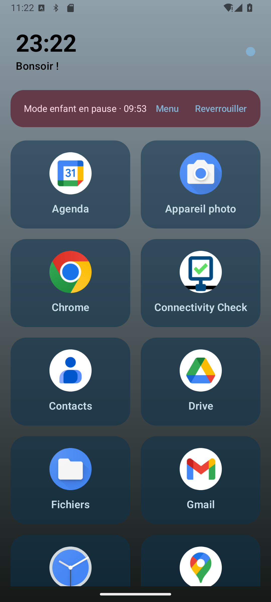
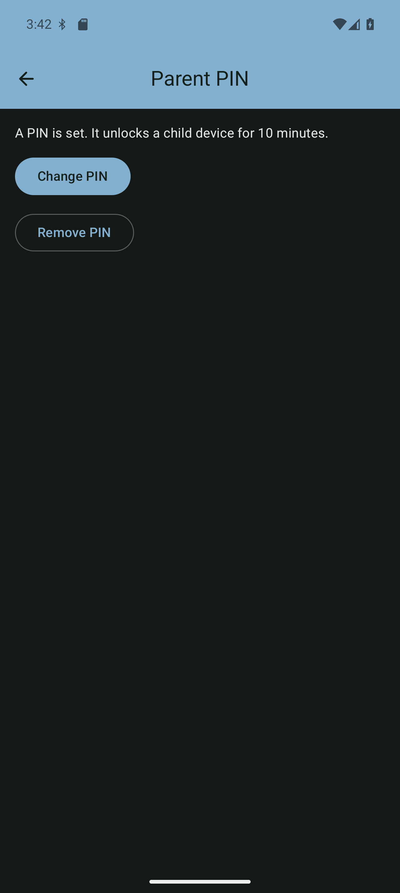
</div>

The PIN is hashed (PBKDF2-HMAC-SHA256, 20 000 iterations, per-device salt) on the
parent's phone before it is ever sent; the child's phone stores and compares only
the hash. Wrong guesses trigger a lockout that grows and survives killing the app.

### A parent menu on the child's phone

The same PIN opens a menu on the child's phone that answers "why is this phone
behaving like this?" — the rules actually in force, whether the parent's phone is
in range, which parent it is paired to, and what the device is. Everything is read
from the child's own storage, so it still answers when the parent is nowhere near.

From there a parent can pause child mode, or re-pair the phone to a different
parent by scanning a fresh code — the way back if the parent's phone is lost,
replaced, or reinstalled.

Reading the menu needs nothing; changing anything needs the PIN. If no PIN has
been set, those two actions appear only while the phone is not actually
restricted, so a child cannot open the menu on a locked phone and simply pause it
or point it at someone else's.

<div align="center">
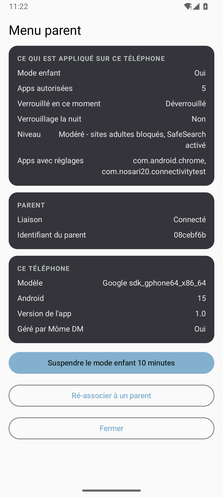
</div>

### The parent's view

Which apps are allowed, what the child is using right now, battery, when the
phone was last seen, whether it is locked — with the controls to change any of it.
Installing something new is done by name rather than by package id: type "Minecraft"
and the child's Play Store opens on that search, so a parent never has to know
what `com.mojang.minecraftpe` is. The store is only reachable on the child's phone
for ten minutes after a parent asks for it — otherwise it stays out of reach, so a
link in an allowed app cannot become a way to install whatever they like.

When the child's phone is out of range, the controls that need it are disabled and
the page says so plainly, including the part that matters: commands are not saved
up to send later.

<div align="center">
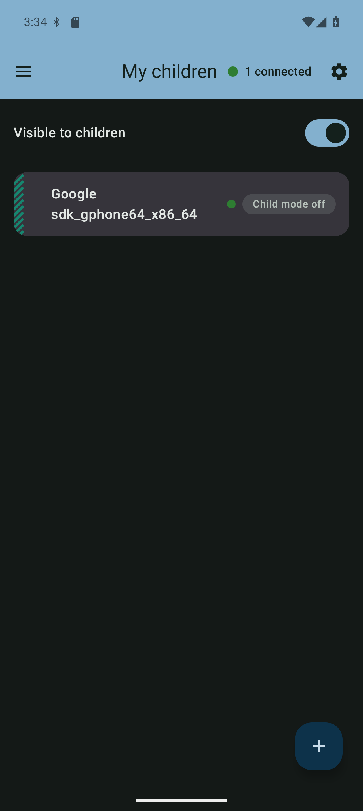
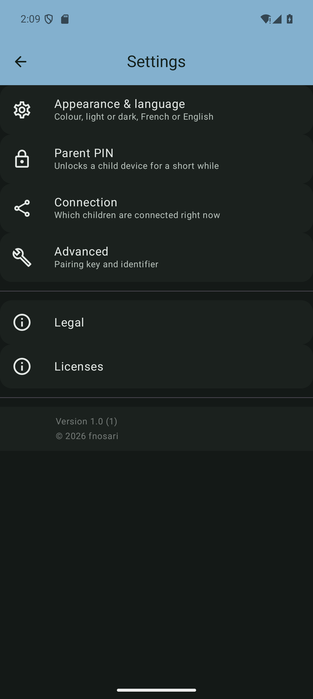
</div>

### The parent chooses how it looks

Theme, accent colour and language are picked on the parent's phone and pushed to
the child's, so a child's phone shows the family's choices rather than its own —
including the language. Fully bilingual, **English and French**, with the two
string files kept key-for-key in sync by a test that fails the build otherwise.

<div align="center">
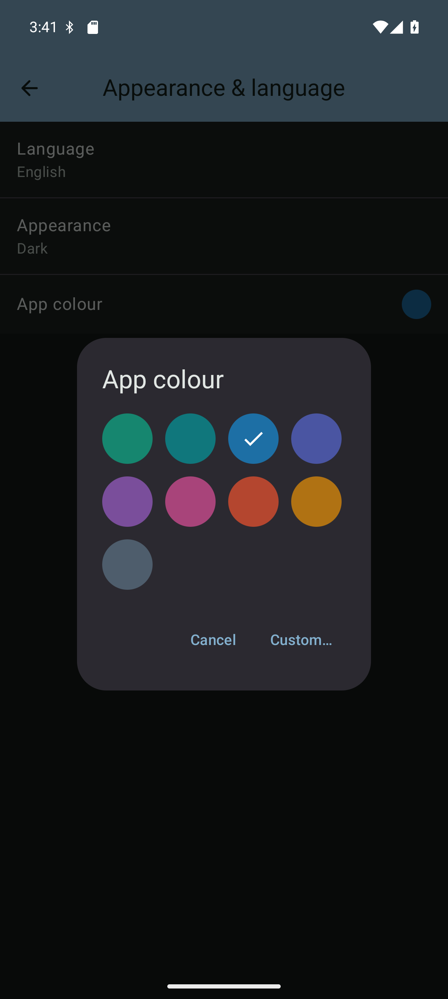
</div>

### Keeping an eye on the link itself

BLE is invisible when it works and baffling when it doesn't, so the parent's app
has a screen for it: whether this phone is currently visible to children, how many
are connected, and a log of recent activity — including the case that actually
happens, a phone that connects but was set up with a *different* pairing code, and
which says so in those words instead of failing silently.

The same settings hold the pairing key's fingerprint and a **regenerate** button.
Regenerating invalidates every enrolled child until each is paired again, which the
confirmation says plainly before you do it.

### Setting up a child's phone

The child's phone needs to reach yours just long enough to fetch the app, and
there are three ways to arrange that: your home Wi-Fi, the parent's phone acting
as a hotspot so no existing network is needed at all, or a plain link if you would
rather serve the file yourself. Any of them does the same job.

<div align="center">
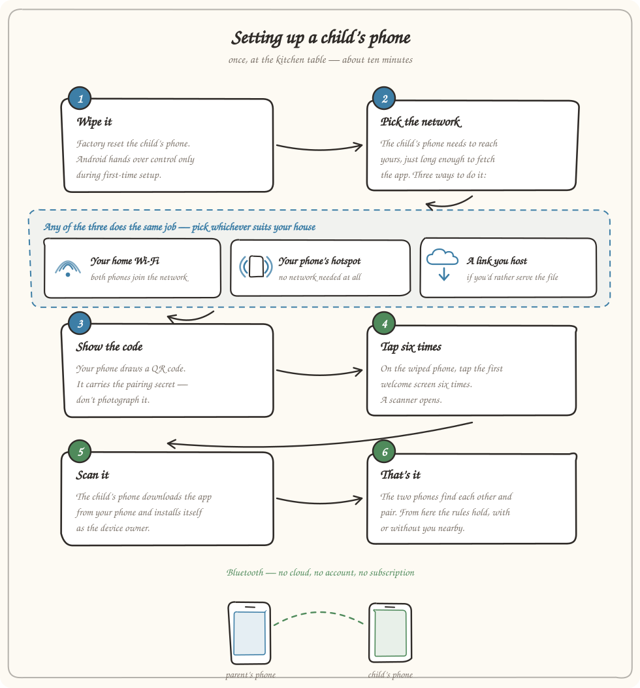
</div>

<div align="center">
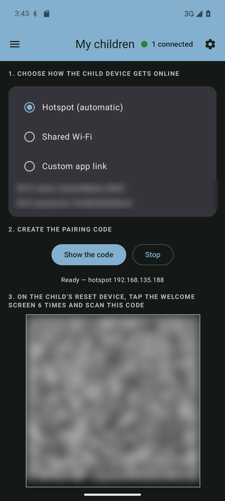
</div>

*The pairing code and Wi-Fi password are blurred in this screenshot on purpose —
that code carries the shared secret, so treat the real one as sensitive while it
is on screen.* It expires after five minutes, and the download is switched off with
it, so a code left on a table stops being useful.

And the same thing again with the traffic drawn in, for anyone who wants to know
what their phones are actually saying to each other:

<div align="center">
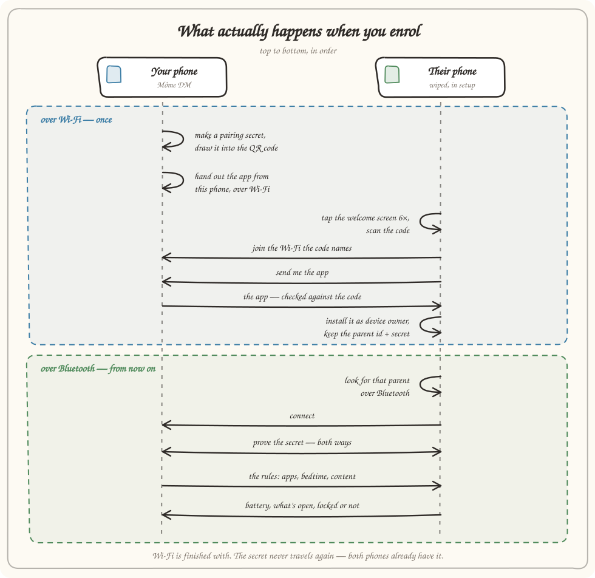
</div>

Afterwards the child's phone can be given a name of its own, and a Google account
can be added to it from the parent's phone without leaving the launcher.

## Requirements

- Two Android phones on **Android 14 (API 34)** or newer.
- The child's phone must be **factory reset** to be enrolled — Android grants
  device-owner rights only during initial setup, before any account is added.
- Bluetooth on both. No internet, Google account or Play services are needed for
  day-to-day use.
- **On Android 16 and newer, the parent's phone will ask for local network
  access** the first time you pair a device. Enrolment cannot work without it:
  the child's phone downloads the app directly from the parent's phone, and
  Android blocks that traffic unless the permission is granted. If it is denied,
  the platform still accepts the connection and then silently discards it, so the
  download hangs with no error on either screen.

## Installing

```bash
git clone https://github.com/nosari20/momedm.git
cd momedm
./gradlew assembleDebug        # app/build/outputs/apk/debug/app-debug.apk
```

Install that APK on the parent's phone and open it, then follow the **enrolment**
screen for the child's phone. [`docs/testing.md`](docs/testing.md) has the full
walkthrough, including the emulator route if you want to try it without two
handsets.

## How it works

```
Parent phone                                  Child phone
┌──────────────────────────┐                  ┌──────────────────────────┐
│ ControllerService         │   BLE GATT       │ ManagedLinkService        │
│  advertises, holds        │◄────────────────►│  scans, connects,         │
│  sessions, sends commands │   MdmService     │  applies policy           │
└──────────────────────────┘                  └──────────────────────────┘
                                                          │
                                                DevicePolicyManager
                                          (lock task, home, restrictions)
```

The parent's phone runs a BLE GATT server; the child's phone scans for it and
connects. On top sits a small protocol: messages are chunked to the negotiated
MTU, a mutual HMAC-SHA256 handshake derives a session key, and every message
afterwards carries a per-direction MAC and a monotonic sequence number, so a
captured frame cannot be replayed — in either direction.

The `protocol/` package is pure Kotlin with no Android imports, which is why the
framing, handshake, secure channel and lock schedule are all covered by ordinary
JVM tests.

For the deeper version — the exact handshake, the framing format, the commands,
and the threat model with its limits — see
[`docs/architecture.md`](docs/architecture.md).

## Testing

```bash
./gradlew :app:testDebugUnitTest   # JVM unit tests
./gradlew :app:assembleDebug       # build the APK
```

Two layers, covering different things:

- **JVM tests** cover everything that can be pure — protocol framing, the
  handshake, the secure channel, the lock schedule's date maths (including DST),
  persistence, command dispatch, and the lock controller's decisions.
- **A two-emulator rig** covers what has no JVM fake: `DevicePolicyManager` lock
  task, `AlarmManager`, the broadcast receivers, and the BLE link itself. Two
  emulators share an emulated Bluetooth stack, so the whole parent↔child flow
  runs between them.

That second layer is not ceremony. Two real defects here — a busy loop, and a
reboot race that silently downgraded a complete lock so apps could launch while
the bedtime screen still claimed the phone was locked — were invisible to unit
tests and to code review, and only surfaced on devices. See
[`docs/testing.md`](docs/testing.md).

## Known limitations

Stated plainly, because a parental-control tool that oversells itself is worse
than useless:

- **Emergency calling works, but not the way Android suggests.** A locked phone
  shows an explicit **Emergency call** button, because the power-menu route the
  platform documents is not reliable: on a Samsung running Android 14, holding
  power under a lock produces no menu at all, even with the correct flag set.
  Instead the lock allows the device's emergency dialer specifically, and nothing
  else — verified on hardware.
- **A night lock cannot currently be ended remotely** — only by the parent PIN on
  the child's phone, or by waiting for the window to close.
- **One shared secret and one PIN for the whole family**, not one per child. That
  is deliberate — a parent should not have to track which code belongs to which
  phone — but it means that extracting the secret from one child's phone exposes
  the others, until the parent regenerates it and re-enrols them all.
- **No silent app installation.** The parent can open a Play listing on the
  child's phone; someone still has to tap Install. Silent installation requires
  being a registered enterprise EMM.
- **The BLE link is authenticated, not encrypted.** Messages cannot be forged or
  replayed, but they are not confidential to someone sniffing the radio — and the
  parent PIN's hash is among the things that cross it when a PIN is set or changed.
  The hash is PBKDF2-salted, but a four-digit PIN behind it is not much work for
  someone determined.
- **Physical access wins.** A factory reset removes the app entirely.

## Contributing

Contributions are welcome — especially real-device reports for the gaps above.
Read [CONTRIBUTING.md](CONTRIBUTING.md) first: it covers the architectural rules
(lock state is never persisted, `protocol/` stays Android-free, strings live in
both languages) and what "I tested it" has to mean here.

Security issues go through [SECURITY.md](SECURITY.md), not the public tracker.

This repository also ships [Claude Code](https://claude.com/claude-code)
configuration in [`.claude/`](.claude/) — skills describing the emulator rig, how
to add a management command end-to-end, and the string-parity rules. Useful
reading even if you never run Claude.

## Licence

[Apache License 2.0](LICENSE) — see [NOTICE](NOTICE).
